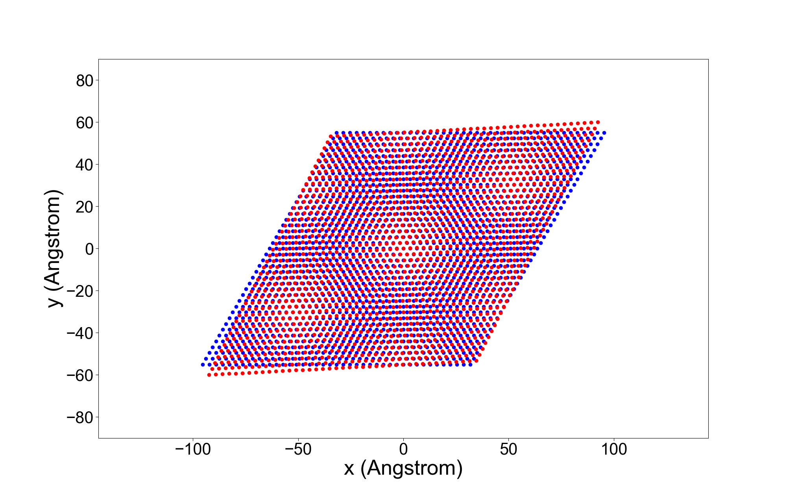
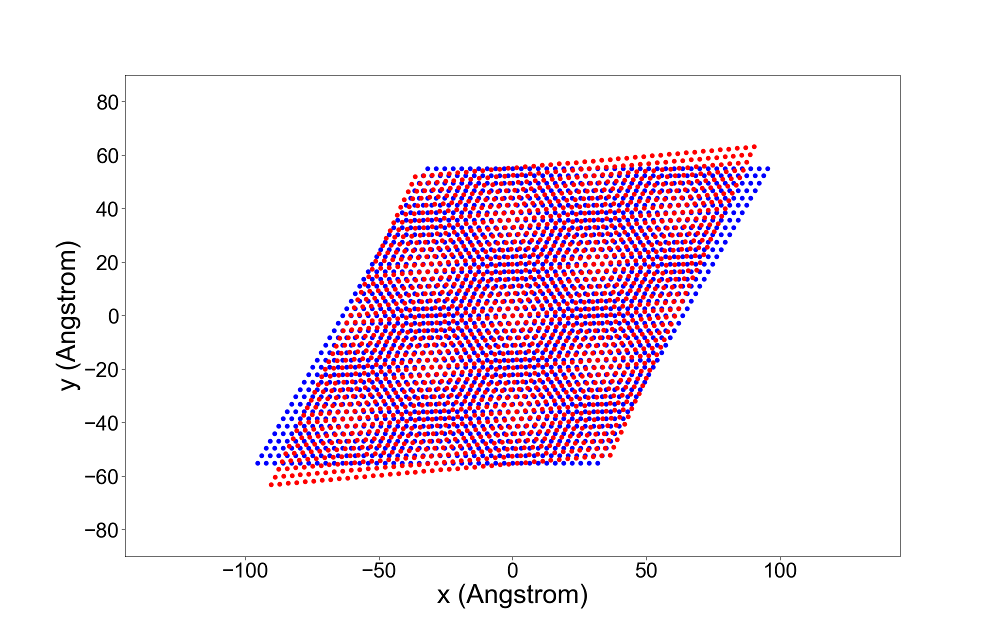

# Twisted Moire Superlattice 


Simulating twisted MoS2 biayer with varied twisted angles in Linux. 


## Dependency

- `matplotlibcpp` - to visualize moire superlattice, please go to the [github repository](https://github.com/lava/matplotlib-cpp)
- `eigen3` - to do matrix multiplation. Do install `libeigen3-dev`

  
## To Use

Just do 
```bash
mkdir build
cd build
cmake ..
make -j4
./twisted_moire
```
then it will ask
`Twisted Angle:? (float)`
Once you input the angle, the program will eat the input as twisted angle then generate lattice with twisted angle. Then overlay them together.

## More with shell script

the shell script `more.sh`

can run the c binary repeatedly with odd number angle 


## Twisted Angle Figures


| **$\theta=3^\circ$** | **$\theta=5^\circ$** |
|---------------------|---------------------|
|  |  |
| **$\theta=7^\circ$** | **$\theta=9^\circ$** |
|  |  |

where $\theta$ denotes the twisted angle

More figures can be found in `/images` subdirectory


## To-Dos

- More Transition-metal dichalcogenide (TMD) materials of different lattice constants can be further implemented

